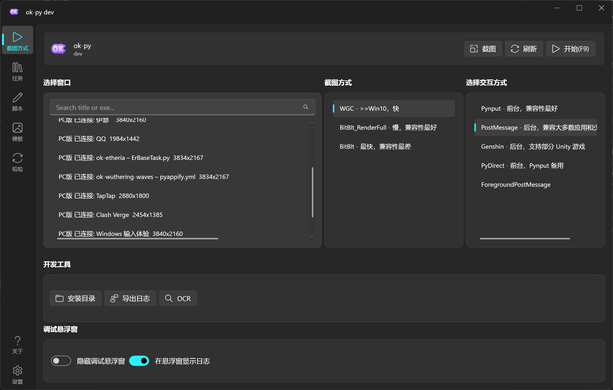
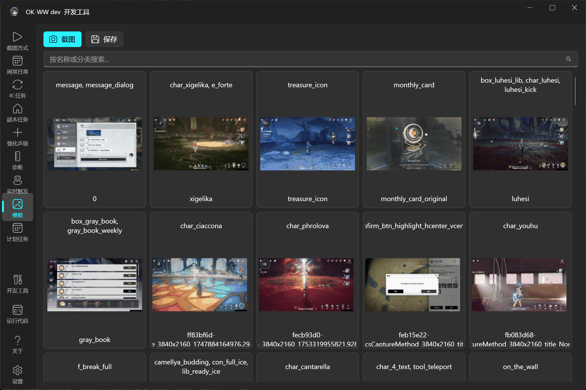

# ok-nikke

[中文](../index.md)

ok-nikke is a Python automation project built on [ok-script](https://github.com/ok-oldking/ok-script), providing a GUI automation app for the Windows client of Goddess of Victory: NIKKE.

This repository is not the ok-script template itself. It includes a runnable GUI, task and configuration-widget examples, OCR, template matching, tests, i18n, EXE packaging, and update/release configuration.

## Start Here

1. Create and initialize a repository with the [Quick start](getting-started.md).
2. Select at least one runtime target in [App configuration](configuration.md).
3. Create and register the first task with [Task development](tasks.md).
4. Build an EXE with [Packaging and release](release.md).

## Demo

### API List and Script Recording

### Capture and Interaction Methods

### Annotation and Template Matching

## Included

- `MyOneTimeTask` and `MyTriggerTask` examples.
- Drop-down, boolean, numeric, text, list, multi-selection, file, global configuration, and button widgets.
- OCR, relative-region recognition, and template matching examples.
- `ConfigOption` global configuration and `TaskTestCase` test examples.
- gettext i18n sources and compiled catalogs.
- PyAppify and GitHub Actions packaging/release configuration.

## Further Reading (Chinese)

- [Intro to game automation](https://github.com/ok-oldking/ok-script/blob/master/docs/intro_to_automation/README.md)
- [ok-script quick start](https://github.com/ok-oldking/ok-script/blob/master/docs/quick_start/README.md)
- [After quick start](https://github.com/ok-oldking/ok-script/blob/master/docs/after_quick_start/README.md)
- [API documentation](https://github.com/ok-oldking/ok-script/blob/master/docs/api_doc/README.md)
