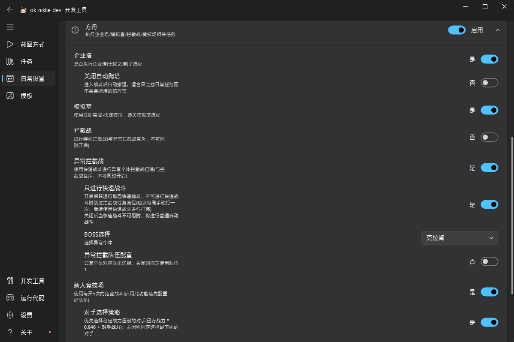
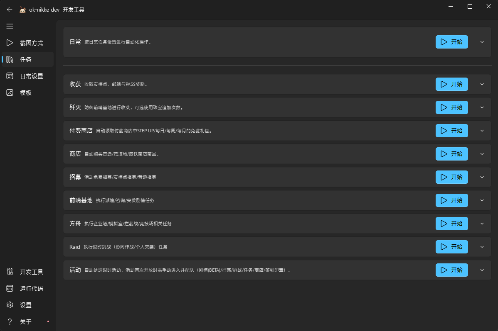

# 快速开始

## 下载与运行

1. 从 [GitHub Releases](https://github.com/c6n1aa/ok-nikke/releases) 下载最新便携包 `ok-nikke-win32-portable.zip`，解压到任意英文目录。
2. 以管理员身份运行 `ok-nikke.exe`（入口程序会自己请求提权，弹 UAC 时点「是」）。
3. 启动游戏本体。
4. 打开“日常设置”界面，对需要运行的任务进行开关、配置。

    

5. 回到“任务”界面，点击“日常”开始。

    

## 使用说明

- “任务”界面下的各项子任务可进行单独单次执行，在“任务”界面下修改任务的设置会同步到日常设置里。
- **国际服**用户可通过设置界面设置启动器路径，后续可直接在应用内启动游戏。
- **必须以管理员身份启动**：游戏以管理员权限运行时，自动化程序也需要同等权限，否则截图或输入可能失效。
- 游戏分辨率需为 16:9 且不低于 1600×900。
- 游戏窗口需保持前台可见：输入通过 Windows 接口模拟（Pynput / PyDirect），不支持后台点击；截图优先使用 WGC。
- 任务开关与配置项都在主界面选择；程序按日/周记录完成状态，已完成的任务不会被重复执行。

## 应用内更新

「关于 → 应用更新」里可以检查更新、切换更新源（自动 / GitHub / CNB 镜像）：

- 出厂为「自动」：中文系统默认走 CNB 国内镜像，其它系统走 GitHub。
- 更新时会自动拉取代码，必要时重装依赖，完成后应用自动重启；**更新过程会打开一个控制台窗口显示进度**（拉代码 / 装依赖 / 失败原因），日志同时写在包内 `logs/update.log`，失败原因也会在「关于 → 应用更新」里回显。

## 常见问题

- **截图全黑或识别不到画面**：确认程序与游戏权限一致（同为非管理员或同为管理员），并关闭 HDR 或允许 AutoHDR 提示。
- **分辨率不匹配**：确认游戏窗口为 16:9 且不低于 1600×900。
- **检查更新失败**：确认网络可达所选更新源，或到「关于 → 应用更新」切换到另一个源。
- **更新后打不开**：查看 `logs/update.log` 与 `logs/ok-script.log`；必要时删除 `configs/` 目录下的配置后重启（会重置任务配置），仍失败则从 Releases 重新下载便携包。
